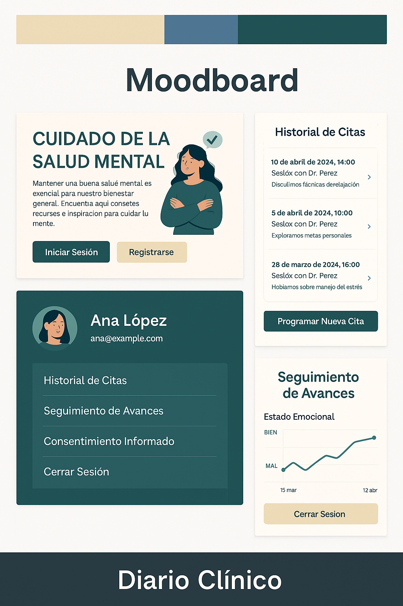

# Nombre de la App 
Diario Clínico

# Descripción de la App

Diario Clínico es una webapp diseñada para que los pacientes puedan acceder a su historial de citas y avances terapéuticos de manera segura y privada. La plataforma también ofrece información general sobre salud mental y permite programar nuevas citas con su terapeuta. El objetivo es facilitar el seguimiento de los avances emocionales y promover el autocuidado.

# Moodboard (Diseño UI)

# Algoritmo en Lenguaje Natural

	1.	Inicio
	•	El usuario abre la aplicación.
	•	Muestra la pantalla de inicio con información general sobre salud mental.
	•	Se ofrecen dos botones: Iniciar Sesión y Registrarse.

	2.	Inicio de Sesión o Registro:
	•	Si el usuario elige Iniciar Sesión:
	•	Ingresa correo y contraseña.
	•	El sistema verifica las credenciales.
	•	Si son correctas, redirige al perfil.
	•	Si son incorrectas, muestra un mensaje de error.
	•	Si el usuario elige Registrarse:
	•	Completa el formulario con nombre, correo, contraseña y confirmación.
	•	Acepta el consentimiento informado.
	•	El sistema valida el correo y la seguridad de la contraseña.
	•	Si los datos son válidos, crea la cuenta.
	•	Si no, muestra los errores correspondientes.

	3.	Perfil del Usuario:
	•	Muestra la información personal (nombre, correo, foto de perfil).
	•	Opciones disponibles:
	•	Ver historial de citas.
	•	Programar nueva cita.
	•	Acceder al seguimiento de avances.
	•	Ver consentimiento informado firmado.
	•	Cerrar sesión.

	4.	Historial de Citas:
	•	Muestra una lista cronológica de citas anteriores.
	•	Cada cita incluye fecha, hora, notas y estado emocional.
	•	El usuario puede seleccionar una cita para ver los detalles completos.

	5.	Seguimiento de Avances:
	•	Muestra un gráfico con el progreso emocional a lo largo del tiempo.
	•	El usuario puede seleccionar el rango de tiempo a visualizar.
	•	Opcionalmente, el usuario puede agregar observaciones personales.

	6.	Programación de Nueva Cita:
	•	El usuario selecciona una fecha y hora disponibles.
	•	El sistema verifica la disponibilidad del terapeuta.
	•	Si hay disponibilidad, la cita se programa y se envía una confirmación.
	•	Si no hay disponibilidad, muestra un mensaje con opciones alternativas.

	7.	Política de Cancelación:
	•	El usuario puede cancelar la cita desde el historial.
	•	Si cancela con más de 24 horas de anticipación, no hay penalización.
	•	Si cancela con menos de 24 horas, muestra el mensaje de penalización.

	8.	Cierre de Sesión:
	•	El usuario hace clic en Cerrar Sesión.
	•	El sistema invalida el token de autenticación y redirige a la pantalla de inicio.
	9.	Fin

# Diagrama de Flujo del Algoritmo
