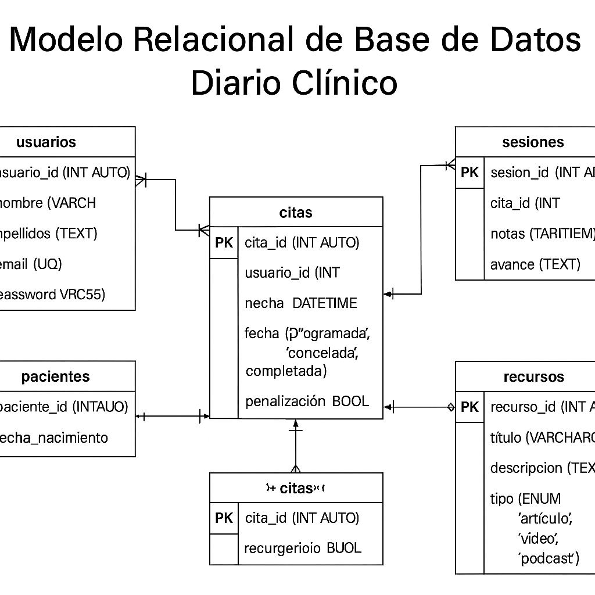
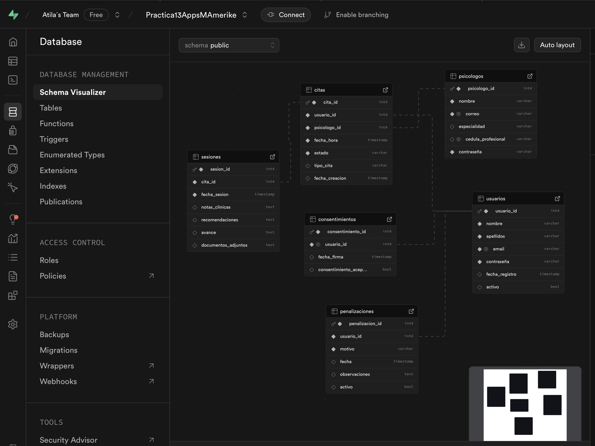

#  Diario Clínico

##  Modelo Entidad-Relación (MER)

### Entidades Principales

#### `usuarios`
- `usuario_id` (PK)  
- `nombre`  
- `apellidos`  
- `email` (UQ)  
- `contraseña`  
- `fecha_registro`  
- `activo` (BOOLEAN)

####  `psicologos`
- `psicologo_id` (PK)  
- `nombre`  
- `correo`  
- `especialidad`  
- `cedula_profesional`  
- `contraseña`  

####  `citas`
- `cita_id` (PK)  
- `usuario_id` (FK → usuarios)  
- `psicologo_id` (FK → psicologos)  
- `fecha_hora`  
- `estado` (ENUM: 'agendada', 'cancelada', 'finalizada')  
- `tipo_cita`  
- `fecha_creacion`  

####  `sesiones`
- `sesion_id` (PK)  
- `cita_id` (FK → citas)  
- `fecha_sesion`  
- `notas_clinicas`  
- `recomendaciones`  
- `avance`  
- `documentos_adjuntos`  

####  `consentimientos`
- `consentimiento_id` (PK)  
- `usuario_id` (FK → usuarios)  
- `fecha_firma`  
- `consentimiento_aceptado` (BOOLEAN)

####  `penalizaciones`
- `penalizacion_id` (PK)  
- `usuario_id` (FK → usuarios)  
- `motivo`  
- `fecha`  
- `observaciones`  
- `activo` (BOOLEAN)

---

##  Relaciones entre Entidades

| Origen         | Destino        | Tipo      | Descripción                                           |
|----------------|----------------|-----------|-------------------------------------------------------|
| `usuarios`     | `citas`        | 1 a M     | Un usuario puede agendar múltiples citas              |
| `psicologos`   | `citas`        | 1 a M     | Un psicólogo puede atender múltiples citas            |
| `citas`        | `sesiones`     | 1 a M     | Una cita puede generar una o más sesiones             |
| `usuarios`     | `consentimientos` | 1 a 1 | Cada usuario debe firmar un único consentimiento      |
| `usuarios`     | `penalizaciones` | 1 a M   | Un usuario puede recibir múltiples penalizaciones     |

---

##  Reglas de Negocio

###  `usuarios`

- El `email` debe ser único y validado antes del registro.
- Un usuario puede:
  - Registrar nuevos pacientes.
  - Agendar, modificar o cancelar citas.
  - Registrar sesiones clínicas.
  - Gestionar recursos terapéuticos.
- Los campos `nombre` y `apellidos` son obligatorios.
- La `contraseña` debe tener al menos 8 caracteres y ser almacenada de forma segura.
- El campo `activo` indica si el usuario puede operar dentro del sistema.

---

###  `psicologos`

- Un psicólogo debe registrar su `cédula profesional` y `especialidad`.
- La `contraseña` debe tener las mismas validaciones que en usuarios.
- Su `correo` debe ser único dentro de la tabla de psicólogos.

---

###  `citas`

- Solo pueden programarse citas a futuro.
- La relación con `usuarios` y `psicólogos` debe ser válida (FK existentes).
- El campo `estado` acepta los valores: `agendada`, `cancelada`, `finalizada`.
- Si se cancela una cita con menos de 24h de anticipación, debe generarse automáticamente una penalización activa.
- El campo `tipo_cita` define si es presencial, en línea, u otro.
- Las citas no pueden modificarse si su estado es `finalizada`.

---

###  `sesiones`

- No se puede registrar una sesión sin una `cita` con estado `finalizada`.
- Cada sesión debe incluir:
  - Notas clínicas completas.
  - Observaciones sobre el avance.
  - Recomendaciones.
- El registro de la sesión debe realizarse el mismo día o máximo dentro de las 24 horas siguientes.
- No se permite la edición de sesiones después de ese plazo.

---

###  `consentimientos`

- Todo usuario debe aceptar el consentimiento informado antes de agendar citas.
- Solo puede existir un consentimiento por usuario (`1 a 1`).
- El campo `consentimiento_aceptado` debe ser `TRUE` para considerar al usuario como activo para citas.

---

###  `penalizaciones`

- Se generan automáticamente en casos como:
  - Cancelación tardía de citas.
  - Faltas a citas sin aviso.
- Pueden registrarse manualmente por parte de los psicólogos también.
- El campo `activo` indica si la penalización sigue vigente.
- No se permite eliminar penalizaciones activas.

## Diagrama Relacional

## Modelo de Datos Supabase
